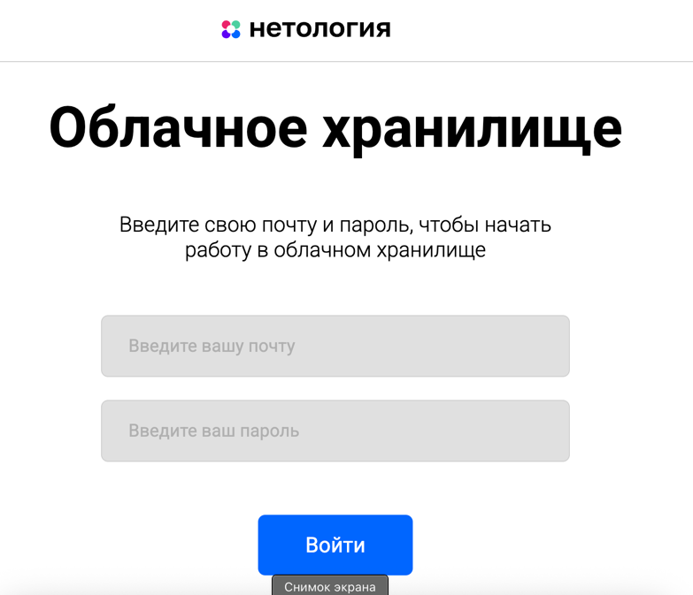

# «Облачное хранилище»

#### ***Сервис предоставляет REST-интерфейс для загрузки файлов и вывода списка уже загруженных файлов пользователя***

Использованы при разработке и проверке:

#### Oracle OpenJDK-22 (Java level 17), Spring 3.3, Maven 3.9, PostgreSQL 17, Docker Desktop 4.40.0

А также Lombok, JsonWebToken (JJWT) и пр.

#### Сервис разработан для работы со сторонним Front-приложением. ([FRONT](https://github.com/netology-code/jd-homeworks/blob/master/diploma/netology-diplom-frontend) ). Используется порт 8080.

#### ***Все запросы к сервису проходят авторизацию***

#### ***Сервис реализует методы, описанные в [yaml-файле](./CloudServiceSpecification.yaml):***

- авторизация
- вывод списка файлов
- добавление файла
- удаление файла
- изменение имени файла
- скачивание файла

#### ***Информация о пользователях сервиса (логины для авторизации) и данные хранятся в базе данных.***

#### Тестовые пользователи: user:user и user2:user2

#### ***Приложение разработано с использованием Spring Boot***
#### ***Использован сборщик пакетов maven***
#### ***Для запуска используется docker***
#### ***Код покрыт unit-тестами с использованием mockito***
#### ***Добавлены интеграционные тесты с использованием testcontainers***
#### ***Авторизация реализована с использованием JWT-токена***
